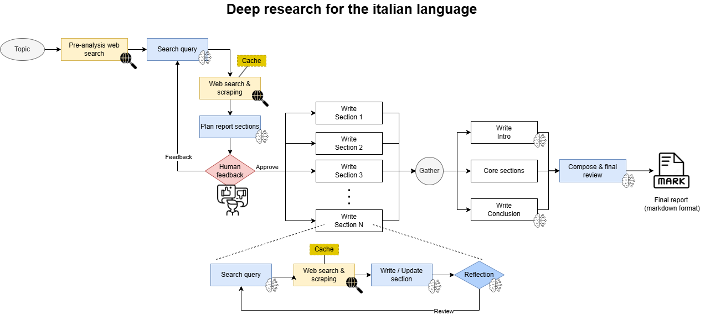

# Deep Research Italiano  
  
Sistema di deep-research automatizzata per la lingua italiana, con architettura back-end modulare (basata su LangGraph) e front-end interattivo sviluppato in Blazor. Ispirato a [Open Deep Research di LangChain](https://github.com/langchain-ai/open_deep_research), ma profondamente rivisto per ottimizzare la ricerca, la generazione e la revisione di report complessi in italiano con citazione delle fonti per una maggiore trasparenza.
  


## Indice  
  
- [Descrizione](#descrizione)  
- [Caratteristiche principali](#caratteristiche-principali)  
- [Architettura](#architettura)  
- [Installazione](#installazione)  
- [Utilizzo](#utilizzo)  
- [Ispirazione e differenze](#ispirazione-e-differenze)  
- [Roadmap](#roadmap)  
- [Contribuire](#contribuire)  
- [Licenza](#licenza)  
  
  
## Descrizione  
  
Questo progetto offre una piattaforma di ricerca automatizzata per la lingua italiana, suddivisa in un back-end e un front-end user-friendly. Il sistema è stato progettato per sperimentare l'impiego di sistemi AI per la  creazione di report documentati, strutturati e facilmente verificabili.  
  
Il back-end, sviluppato con [LangGraph](https://github.com/langchain-ai/langgraph), si occupa della pianificazione, ricerca, generazione e revisione dei contenuti. Il front-end, realizzato in [Blazor](https://dotnet.microsoft.com/apps/aspnet/web-apps/blazor), consente agli utenti di seguire in tempo reale l’avanzamento del processo, intervenire con feedback e gestire l’intero workflow in modo intuitivo.  
  
## Caratteristiche principali  
  
- **Pianificazione intelligente**: Il planner effettua una ricerca preliminare per determinare le query più efficaci, ottimizzando la ricerca per il planning delle sezioni del report.  
- **Human-in-the-loop**: Supporto completo al feedback umano, con possibilità di approvare il piano delle sezioni o fornire un feedback per revisionarlo.  
- **Ricerca senza API key**: Utilizzo di sistemi di ricerca che non richiedono API key, garantendo facilità di avvio e costi ridotti.  Può essere comunque esteso con servizi a pagamento.
- **Prompt specifici**: Prompt completamente rivisti per la stesura e la revisione delle sezioni, con strategie per evitare sovrapposizioni tra i writer e migliorare la coerenza del report.  
- **Citazioni trasparenti**: Generazione di contenuti con citazioni numerate (ottenute con accorpamento delle fonti acquisite per ogni sezione), garantendo tracciabilità e trasparenza delle fonti.
- **Revisione finale**: Fase dedicata alla revisione globale del report per garantire coerenza, completezza e qualità.  
- **Cache per scraping**: Sistema di caching per ottimizzare lo scraping dei contenuti e ridurre i tempi di risposta.  
- **Supporto PDF**: Lettura e analisi di contenuti anche in formato PDF.  
- **Estendibilità LLM**: Possibilità di integrare modelli linguistici proprietari o di terze parti (attualmente supportato OpenRouter).  
- **Front-end Blazor**: Interfaccia che mostra in tempo reale l’evoluzione del report e consente l’interazione continua dell’utente.  
- **Controllo processo**: Possibilità di interrompere il processo direttamente dal front-end.  
  
  
## Architettura  
  
| Componente | Tecnologia | Descrizione |  
| :-- | :-- | :-- |  
| Back-end | LangGraph (Python) | Gestione workflow, pianificazione, scraping, generazione e revisione testi. |  
| Front-end | Blazor (.NET) | Interfaccia utente reattiva, feedback, monitoraggio e controllo processo. |  
| LLM | OpenRouter | Generazione e revisione dei contenuti tramite LLM estendibili. |  
| Ricerca & Cache| Custom | Ottimizzazione scraping e gestione PDF. |  

## Come funziona

 1.  **Input e Pianificazione**: L’utente inserisce il tema di ricerca. Il planner effettua una ricerca preventiva per determinare le query più utili e sviluppare una bozza del piano delle sezioni.

2.  **Revisione Umana**: Il piano viene presentato all’utente, che può esprimere un feedback per revisionarlo o approvarlo.
    
3.  **Ricerca e Generazione**: Il sistema esegue in parallelo per ogni sezione ricerche web, aggrega e cache le fonti, e genera i contenuti usando prompt distinti per la prima stesura e le revisioni successive.
    
4.  **Citazioni e Fonti**: Ogni sezione include citazioni rinumerate, con accorpamento delle fonti per chiarezza e verificabilità.
    
5.  **Revisione Finale**: Il report completo viene sottoposto a una revisione globale automatica e, se necessario, manuale.
    
6.  **Visualizzazione Live**: Il front-end mostra in tempo reale l’avanzamento, consente feedback e permette di abortire il processo in qualsiasi momento.

 
  
## Installazione  
  
> **Nota:** Le istruzioni dettagliate saranno presto disponibili.  
> È richiesta una configurazione Python per il back-end e un ambiente .NET per il front-end.  
  
1. Clona il repository:  
  
```bash  
git clone https://github.com/tuo-username/deep-research-italiano.git```  
  ```
  
## Utilizzo  
  
- Configurare la api key per `openrouter`.  
- Avvia il back-end (deep_research_server.py) e il front-end con vs2022.  
- Accedi all’interfaccia Blazor per:  
  - Inserire la query di ricerca  
  - Monitorare in tempo reale la generazione del report  
  - Fornire feedback e revisionare i contenuti  
  - Interrompere o modificare il processo quando necessario  
- Visualizza e scarica il report finale con tutte le citazioni organizzate.  

**Prerequisiti:**

-   .NET 8+ (per il front-end Blazor)
    
-   Python 3.10+ (per LangGraph e back-end)
    
-   Accesso a OpenRouter o proprio endpoint LLM (opzionale)
  
  
## Ispirazione e differenze  
  
Il progetto si ispira a [open_deep_research di LangChain](https://github.com/langchain-ai/open_deep_research), ma introduce alcune innovazioni:  
  
- Ottimizzazione specifica per la lingua italiana  
- Prompt completamente rivisti  
- Workflow di pianificazione e revisione modificati  
- Front-end interattivo e moderno  
- Gestione avanzata delle citazioni e delle fonti  
- Supporto nativo a PDF e caching dei contenuti  
  
  
## Roadmap  
  
- Integrazione di nuovi sistemi di ricerca 
- Versione specifica per l'ambito legale
- Miglioramento UI/UX Blazor
- Estensione a LLM on-premise  
  
    
## Contribuire  
  
Contributi, suggerimenti e segnalazioni sono benvenuti!  
  
## Licenza  
  
Questo progetto è distribuito secondo la licenza MIT.  
Vedi il file `LICENSE` per i dettagli.  
  
---  
  
*Deep Research Italiano: la ricerca automatizzata, trasparente e collaborativa per la lingua italiana.*